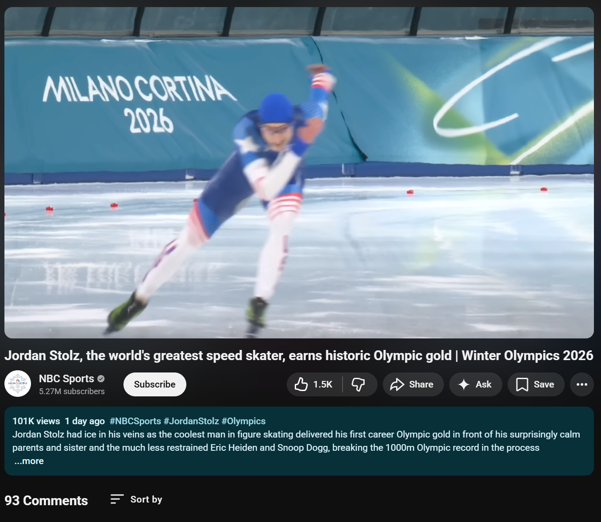
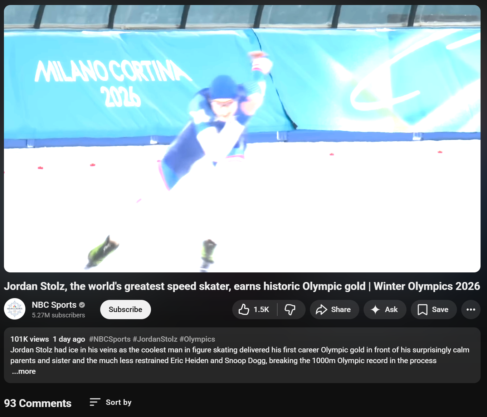

# ScreenCap

Screen capture on Windows has been broken for HDR monitors since HDR was introduced. Snipping Tool, Game Bar, or ShareX, they all capture HDR wrong. They read the framebuffer as if it were SDR, misinterpreting the scRGB pixel data entirely. The result is that Chrome, YouTube, and any other HDR-aware windows come out washed out and overexposed. The only workaround has been switching your desktop back to SDR before taking a screenshot. No third-party software does this right either. It's a bug that has persisted for years.

ScreenCap reads the framebuffer correctly. It captures the scRGB FP16 data via Desktop Duplication and tone-maps it properly to SDR PNG, so what you see on screen is what you get in the file.

| ScreenCap (correct) | Snipping Tool on HDR (overexposed) |
|---|---|
|  |  |

## Features

- **Region capture** (PrtScn) -- drag to select
- **Window capture** (Alt+PrtScn) -- hover to pick
- **Full desktop capture** (Ctrl+PrtScn) -- all monitors composited
- Save to file (PNG) or copy to clipboard
- Toast notification with thumbnail on save/copy
- System tray app, single-instance

## Requirements

- Windows 10 1903+
- Visual Studio 2022 with **Desktop development with C++**
- CMake 3.24+

## Building

```bat
git submodule update --init --recursive
cmake --preset vs2022-x64
cmake --build --preset vs2022-x64 --config RelWithDebInfo
```

Or open the folder in Visual Studio 2022 and select the **vs2022-x64** preset.

## License

MIT-0. See [LICENSE](LICENSE).
